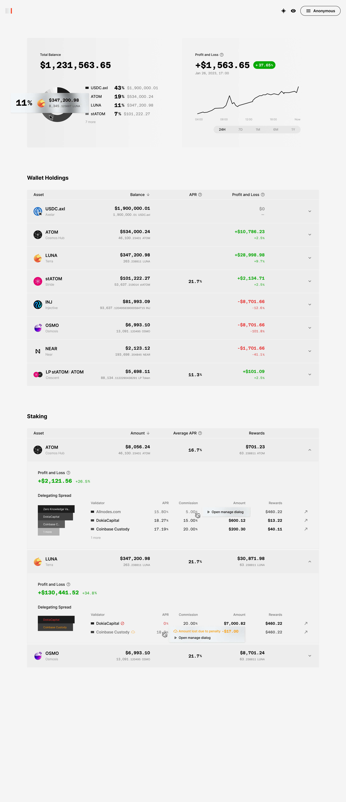

# Paper

Paper is web3 portfolio visualizer, which is to be built using Next, Recoil, ReactQuery, TailwindCSS and web3 libraries for study purposes.

## 1. Overview

## 2. Plan

This project is under interface and UX design wireframing. I am working on basic design system to keep consistent and rythmic typography and organized components.
