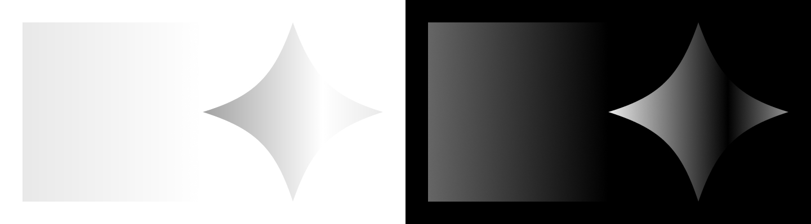
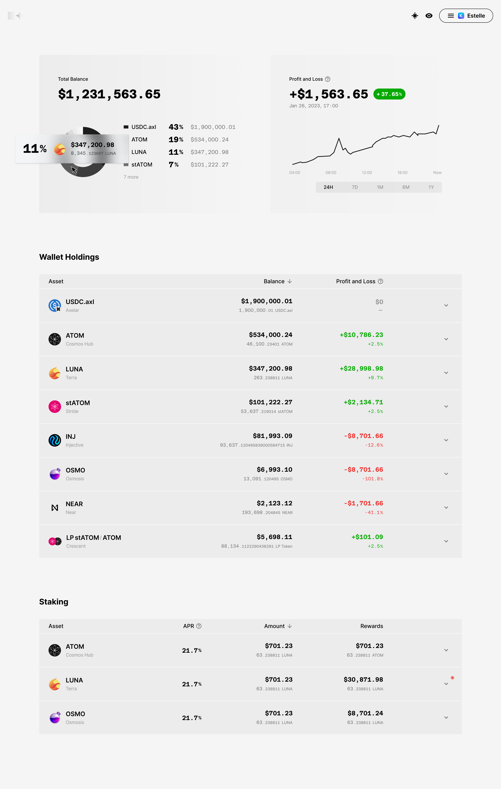
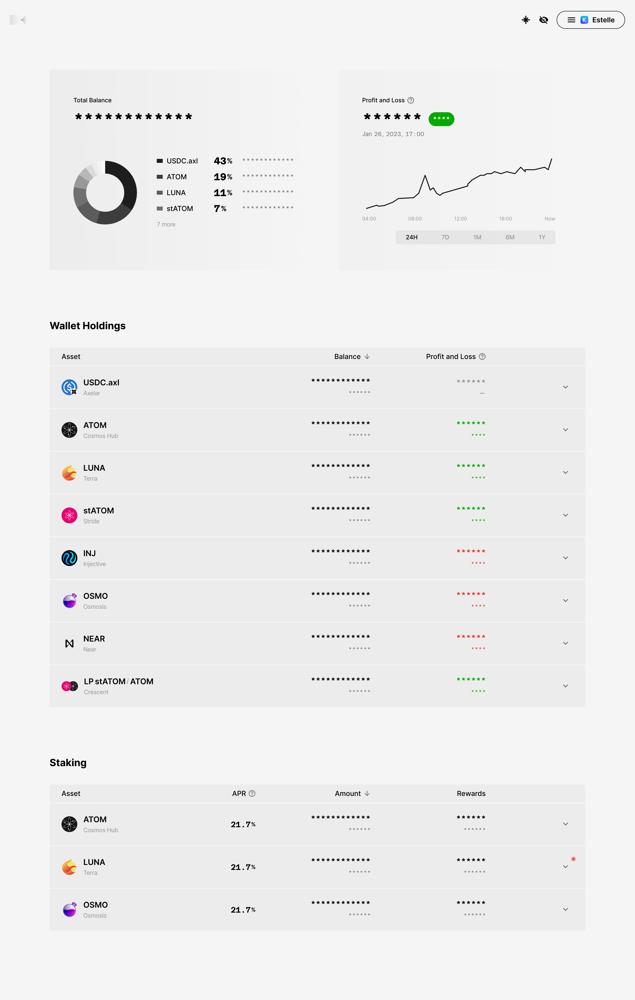
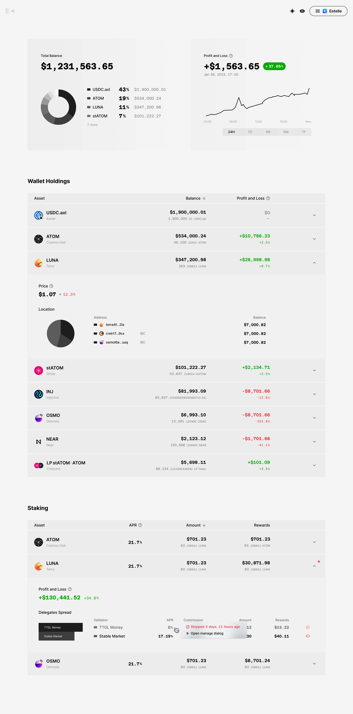
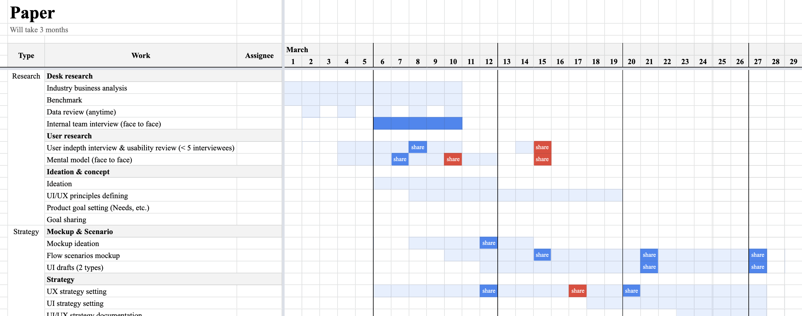
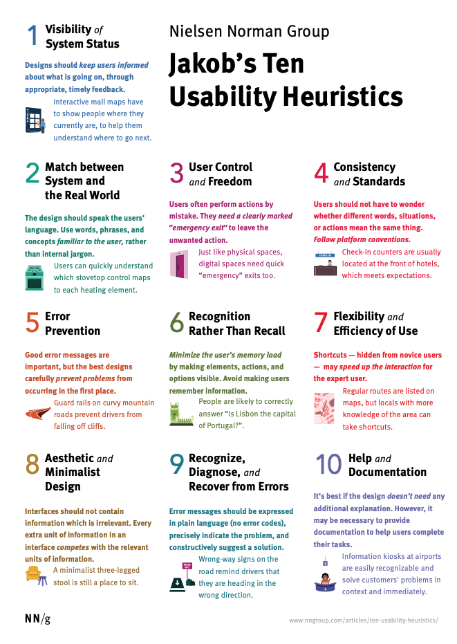

# Paper

<p align="center">
      
</p>

<br />

Paper is web3 portfolio visualizer, which is to be built using Next, Recoil, ReactQuery, TailwindCSS and web3 libraries for study purposes.

<br />

## 1. Overview

### 1-1. Preview


<br />

<br />

<br />

### 1-2. Schedule

This is scheduling table example. Work items are based on the real use-cases I've learned.


<br />

## 2. UX Research

### 2-1. Desk Research

#### Research Goals

- To find repeated keywords
- To find main players in the same market category.
- To see the trend in market; how current services has been changed from the old ones
- To get trailing questions to use in the following user interviews.

<br />

#### Search Keywords

```
web3 portfolio app 
web3 portfolio app examples
web3 portfolio dapp examples
web3 portfolio app trend
...
```

<br />

#### Raw Result

Key features that a Web3 portfolio app might include:

```
1. Multi-chain support: The app should support multiple blockchain networks, such as Ethereum, Binance Smart Chain, and Polygon, to allow users to manage their assets across various blockchains.

2. Portfolio tracking: The app should allow users to track the performance of their investments and monitor the value of their holdings in real-time.

3. Transactions history: Users should be able to view their transaction history and keep track of all their past transactions.

4. Price alerts: The app should provide users with price alerts and notifications to keep them updated on the price movements of their assets.

5. Analytics and insights: The app should provide users with detailed analytics and insights into their portfolio, such as asset allocation, investment performance, and risk assessment.

6. Security: The app should have strong security measures in place, such as multi-factor authentication, encryption, and private key management, to ensure the safety of users' assets.

7. Integration with DeFi protocols: The app could integrate with decentralized finance (DeFi) protocols to enable users to easily manage their investments and participate in yield farming, staking, and other DeFi activities.
```

Examples of Web3 portfolio dapps:

```
1. Aave Portfolio Manager: Aave is a decentralized finance (DeFi) protocol that allows users to lend and borrow cryptocurrency. Aave Portfolio Manager is a dApp that helps users manage their Aave investments by providing a real-time view of their portfolio performance, yield earned, and asset allocation.

2. Zapper: Zapper is a portfolio management dApp that allows users to track their cryptocurrency holdings across multiple DeFi protocols, including Uniswap, Sushiswap, and Curve. It also provides tools for swapping, staking, and borrowing assets.

3. Instadapp: Instadapp is a DeFi management platform that allows users to manage their assets across different DeFi protocols. Its portfolio management tool provides a real-time view of portfolio performance, asset allocation, and yield earned.

4. DeFi Saver: DeFi Saver is a dApp that allows users to manage their DeFi investments across different protocols, including MakerDAO and Compound. It provides tools for portfolio rebalancing, collateral management, and liquidation protection.


5. Nansen: Nansen is a blockchain analytics platform that provides insights into on-chain activity across different DeFi protocols. Its portfolio management tool allows users to track their investments across multiple chains and protocols and provides analytics on portfolio performance and asset allocation.

6. Pulsar: Pulsar is a portfolio management and trading dApp built on the Cosmos blockchain. It allows users to manage their cryptocurrency investments across different Cosmos-based DeFi protocols, including IBC-enabled chains.
```

Examples of Web3 portfolio apps:

```
1. CoinTracking: CoinTracking is a cryptocurrency portfolio management tool that supports over 8,000 coins and tokens from more than 300 exchanges. It offers a range of features including real-time portfolio tracking, tax reports, and customizable dashboards.

2. Accointing: Accointing is a crypto portfolio management platform that offers real-time portfolio tracking, tax optimization tools, and integration with popular exchanges and wallets. It also provides a mobile app for on-the-go portfolio management.

3. Koinly: Koinly is a cryptocurrency tax and portfolio management platform that offers real-time tracking of over 300 exchanges and wallets. It also provides automated tax reports, support for multiple accounting methods, and integration with popular tax filing software.

4. Blockfolio: Blockfolio is a popular mobile app for tracking cryptocurrency prices and managing portfolios. It offers real-time price tracking for over 10,000 cryptocurrencies, portfolio tracking, and alerts for price changes and news updates.

5. Delta: Delta is a crypto portfolio management app that provides real-time tracking of over 6,000 cryptocurrencies across more than 300 exchanges. It offers a range of features including portfolio tracking, price alerts, and integration with popular wallets and exchanges.

```

...
<br />

#### Anatomy of Main Players

##### Check Points

- User flow
- UI tone and manner
- Differntiating points

<br />

##### Target

[Zapper](https://zapper.xyz/)


<br />

##### Review

WIP in Figma


<br />

based on [Jacob Nielsen](https://www.nngroup.com/people/jakob-nielsen/)'s [Ten Usability Heuristics](https://pdfs.semanticscholar.org/5f03/b251093aee730ab9772db2e1a8a7eb8522cb.pdf)

<p align="center">
      
</p>
<br />

#### Cool Ideas from Any Other Apps

WIP in Figma

<br />

### 2-2. Interview

WIP

<br />

## 3. UI Design System

[Figma draft](https://www.figma.com/file/MOkJ3REJI1movw8thd1q7H/PAPER---Web3-Portfolio-Visualizer?node-id=95%3A29298&t=zmYK4fvwkTFkVLkV-1) is work in progress.

<br />

### 3-1. Main Foundations

- Typography: [Major Second Ratio](https://en.wikipedia.org/wiki/Major_second#Epogdoon) based type scales

- Color: Warm gray + TBD

- Grid: 4px baseline, 3 colums (2 columns for mobile)

- Responsiveness: 3 break points; mobile, tablet, labtop

<br />
