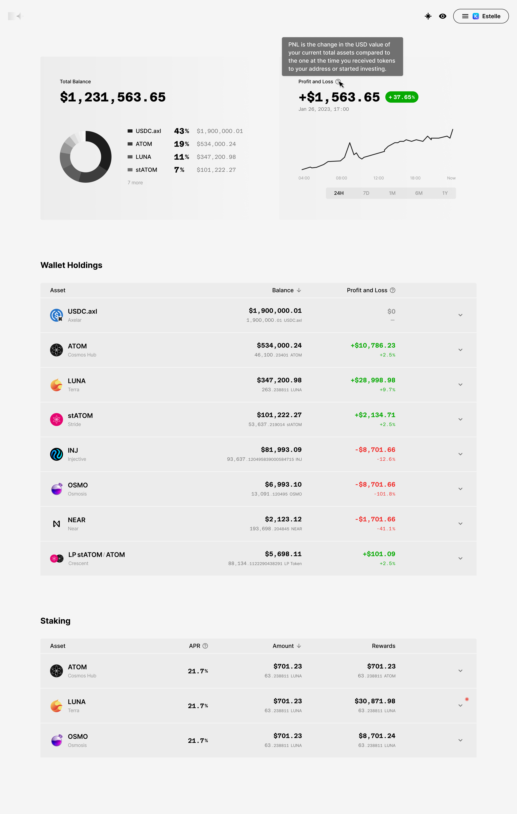
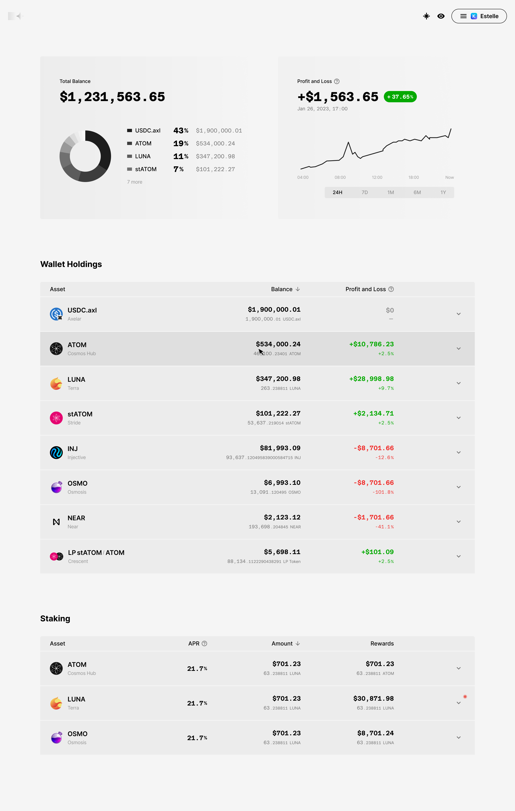
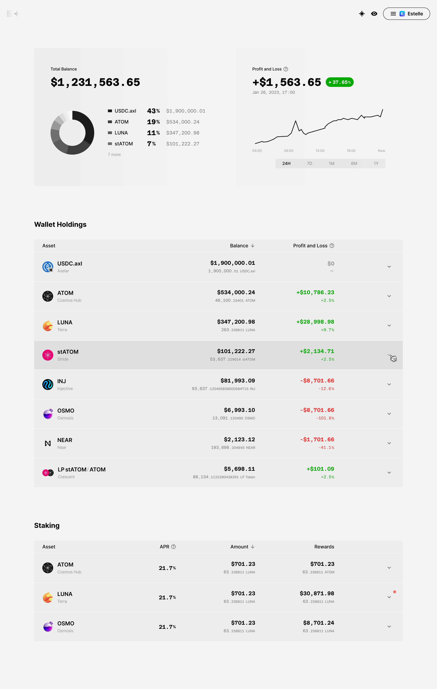
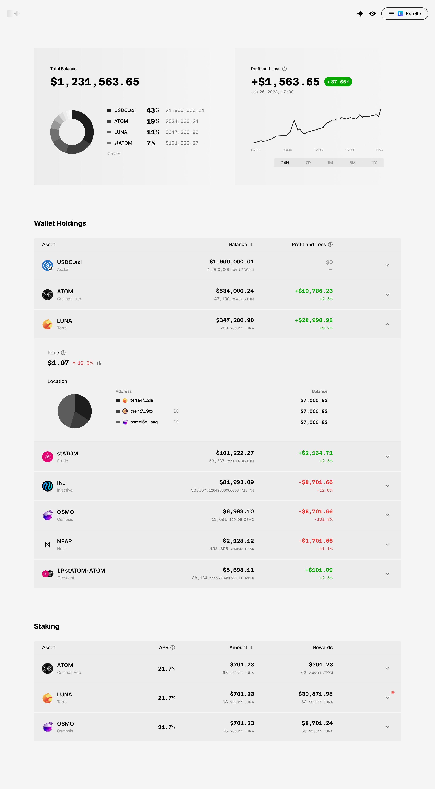
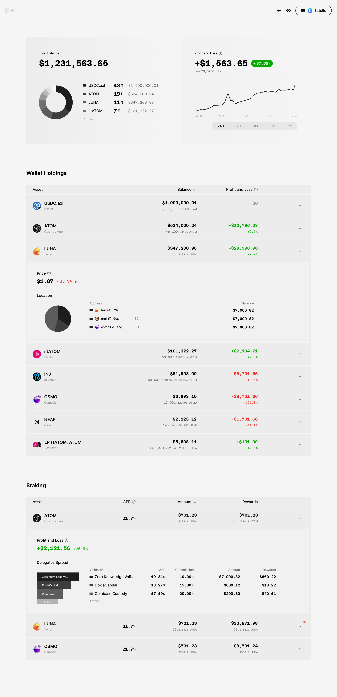
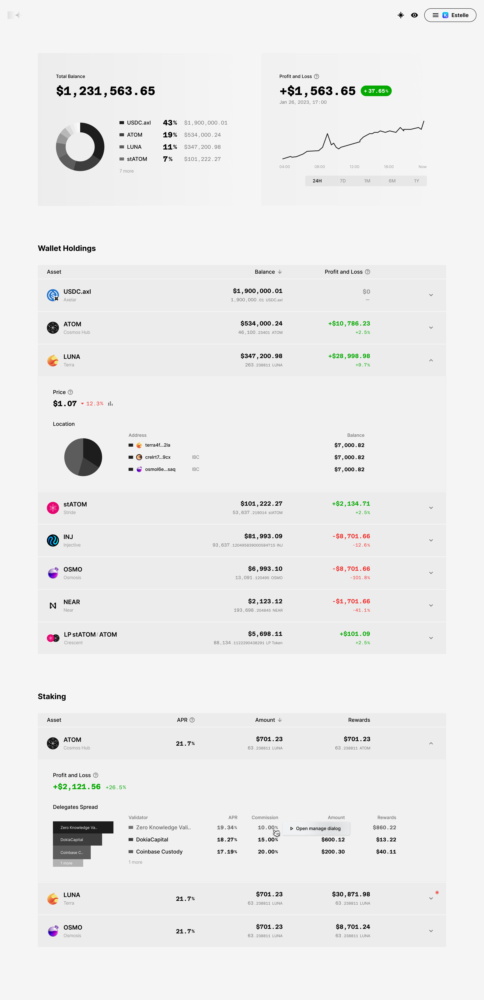
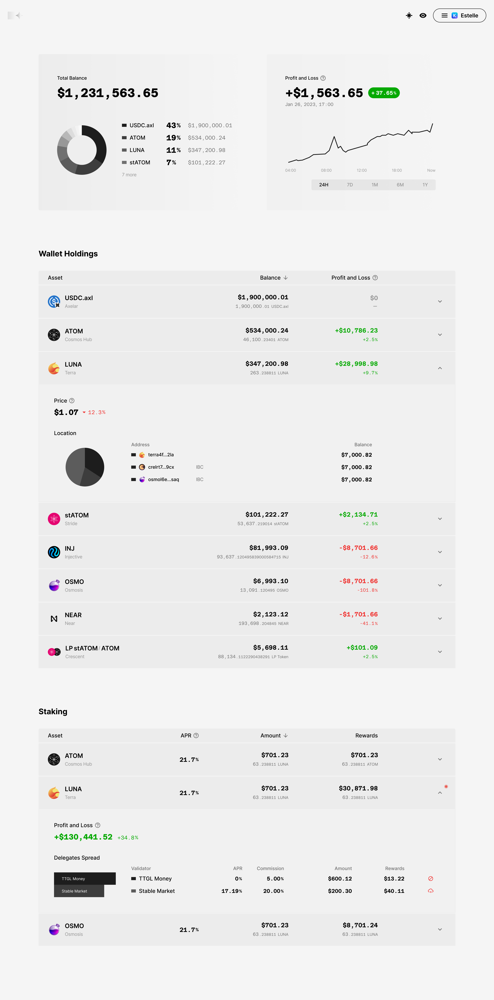
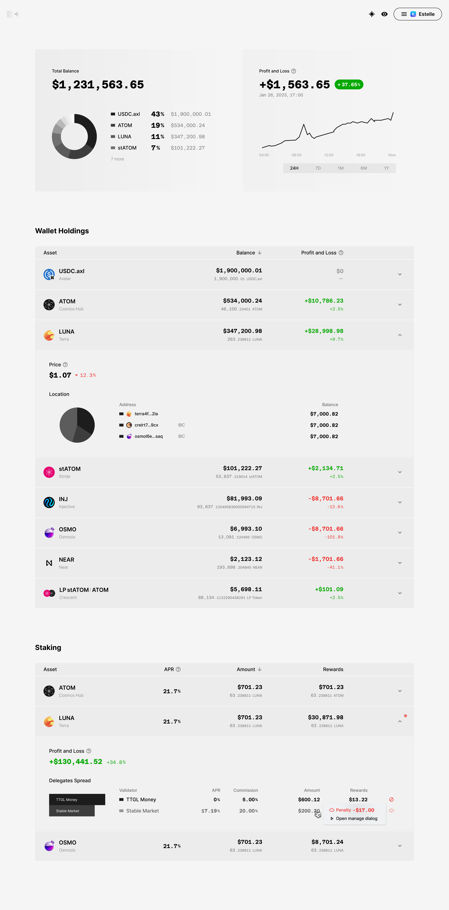

# Paper

 

Paper is web3 portfolio visualizer, which is to be built using Next, Recoil, ReactQuery, TailwindCSS and web3 libraries for study purposes.

 

## 1. Overview

 

 

 

 

 

 

 

 

 

 

 

## 2. Plan

This project is under interface and UX design wireframing. I am working on basic design system to keep consistent and rythmic typography and organized components.

 

### 2-1. Design System Overview

[Figma draft](https://www.figma.com/file/MOkJ3REJI1movw8thd1q7H/PAPER---Web3-Portfolio-Visualizer?node-id=95%3A29298&t=zmYK4fvwkTFkVLkV-1) is work in progress.

- Typography: [Major Second Ratio](https://en.wikipedia.org/wiki/Major_second#Epogdoon) based type scales

- Color: Warm gray + TBD

- Grid: 4px baseline, 3 colums (2 columns for mobile)

- Responsiveness: 3 break points; mobile, tablet, labtop

 
