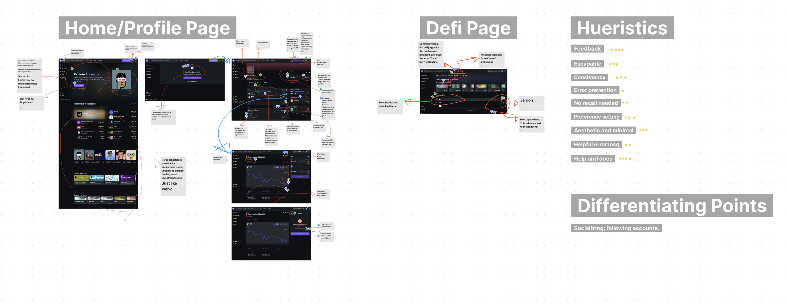
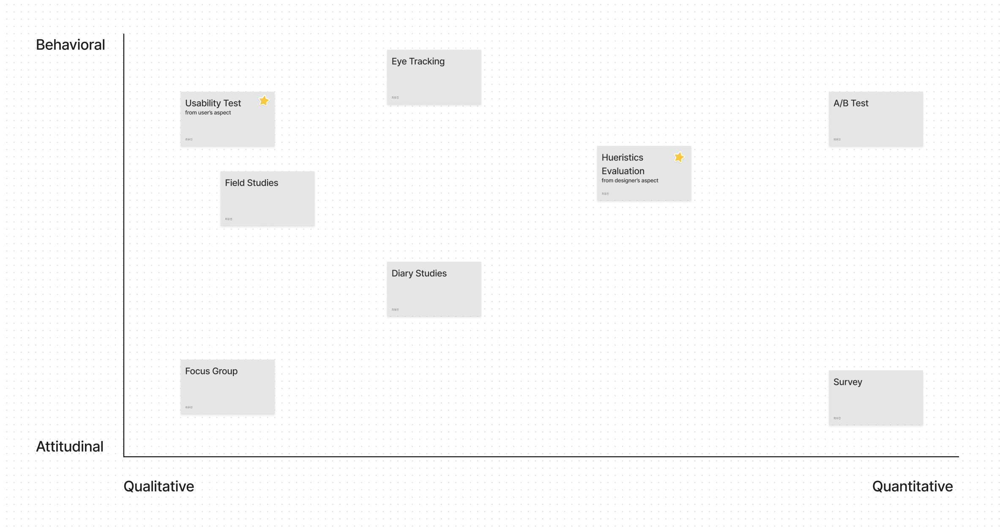
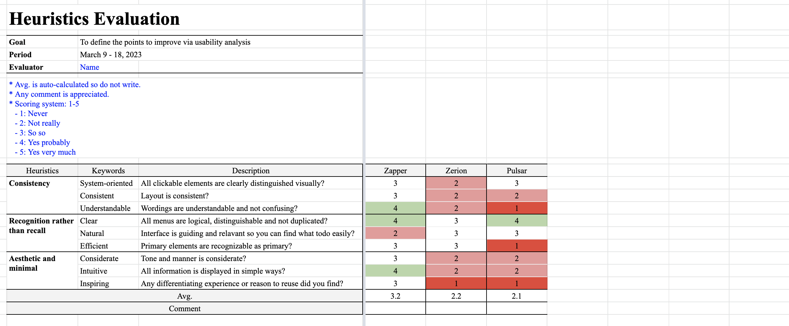
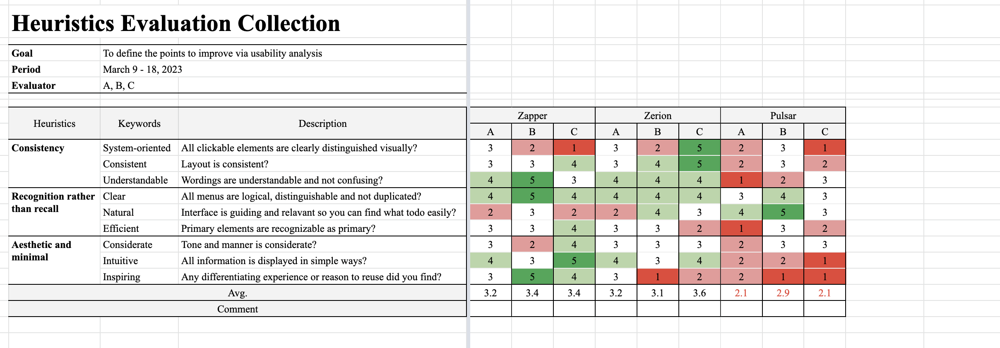

# Paper

<p align="center">
      
</p>

<br />

Paper is web3 portfolio visualizer, which is to be built using Next, Recoil, ReactQuery, TailwindCSS and web3 libraries for study purposes.

<br />

## 1. Overview

### 1-1. Preview


<br />

<br />

<br />

### 1-2. Schedule

This is scheduling table example. Work items are based on the real use-cases I've learned from lectures.


<br />

## 2. UX Research

### 2-1. Desk Research

#### 2-1-1. Research Goals

- To find repeated keywords about industry
- To find main players in the same market category
- To see the trend in market; how current services has been changed from the old ones
- To get trailing questions to use in the following user interviews.

<br />

#### 2-1-2. Industry Analysis Search Keywords

```
web3 portfolio app 
web3 portfolio app examples
web3 portfolio dapp examples
web3 portfolio app trend
...
```

<br />

#### Raw Result Examples

Key features that a Web3 portfolio app might include:

```
1. Multi-chain support: The app should support multiple blockchain networks, 
such as Ethereum, Binance Smart Chain, and Polygon, to allow users to manage 
their assets across various blockchains.

2. Portfolio tracking: The app should allow users to track the performance 
of their investments and monitor the value of their holdings in real-time.

3. Transactions history: Users should be able to view their transaction 
history and keep track of all their past transactions.

4. Price alerts: The app should provide users with price alerts and 
notifications to keep them updated on the price movements of their assets.

5. Analytics and insights: The app should provide users with detailed 
analytics and insights into their portfolio, such as asset allocation, 
investment performance, and risk assessment.

6. Security: The app should have strong security measures in place, 
such as multi-factor authentication, encryption, and private key management, 
to ensure the safety of users' assets.

7. Integration with DeFi protocols: The app could integrate with 
decentralized finance (DeFi) protocols to enable users to easily manage 
their investments and participate in yield farming, staking, and other 
DeFi activities.
```

Examples of Web3 portfolio dapps:

```
1. Aave Portfolio Manager: Aave is a decentralized finance (DeFi) protocol 
that allows users to lend and borrow cryptocurrency. Aave Portfolio 
Manager is a dApp that helps users manage their Aave investments by providing 
a real-time view of their portfolio performance, yield earned, and asset 
allocation.

2. Zapper: Zapper is a portfolio management dApp that allows users to 
track their cryptocurrency holdings across multiple DeFi protocols, 
including Uniswap, Sushiswap, and Curve. It also provides tools for 
swapping, staking, and borrowing assets.

3. Instadapp: Instadapp is a DeFi management platform that allows users 
to manage their assets across different DeFi protocols. Its portfolio
 management tool provides a real-time view of portfolio performance, 
 asset allocation, and yield earned.

4. DeFi Saver: DeFi Saver is a dApp that allows users to manage their 
DeFi investments across different protocols, including MakerDAO and 
Compound. It provides tools for portfolio rebalancing, collateral 
management, and liquidation protection.


5. Nansen: Nansen is a blockchain analytics platform that provides 
insights into on-chain activity across different DeFi protocols. 
Its portfolio management tool allows users to track their investments 
across multiple chains and protocols and provides analytics on portfolio 
performance and asset allocation.

6. Pulsar: Pulsar is a portfolio management and trading dApp built on 
the Cosmos blockchain. It allows users to manage their cryptocurrency 
investments across different Cosmos-based DeFi protocols, including 
IBC-enabled chains.
```

Examples of Web3 portfolio apps:

```
1. CoinTracking: CoinTracking is a cryptocurrency portfolio management 
tool that supports over 8,000 coins and tokens from more than 300 
exchanges. It offers a range of features including real-time portfolio 
tracking, tax reports, and customizable dashboards.

2. Accointing: Accointing is a crypto portfolio management platform that 
offers real-time portfolio tracking, tax optimization tools, and 
integration with popular exchanges and wallets. It also provides 
a mobile app for on-the-go portfolio management.

3. Koinly: Koinly is a cryptocurrency tax and portfolio management 
platform that offers real-time tracking of over 300 exchanges and 
wallets. It also provides automated tax reports, support for multiple 
accounting methods, and integration with popular tax filing software.

4. Blockfolio: Blockfolio is a popular mobile app for tracking 
cryptocurrency prices and managing portfolios. It offers real-time 
price tracking for over 10,000 cryptocurrencies, portfolio tracking, 
and alerts for price changes and news updates.

5. Delta: Delta is a crypto portfolio management app that provides 
real-time tracking of over 6,000 cryptocurrencies across more than 
300 exchanges. It offers a range of features including portfolio 
tracking, price alerts, and integration with popular wallets and exchanges.
```

...
<br />

#### 2-1-3. App Analysis

Have looked up the following of other apps, in terms of 3 factors; Usefulness, Usability, Emotion

- User flow
- Tone and manner
- Differntiating points

<br />

#### Example

Target: [Zapper](https://zapper.xyz/)

- [Review Figjam file](https://www.figma.com/file/HOGzfVFGedXXev35EX0qSo/PAPER?node-id=0%3A1&t=ju63Ku8ihumgVO0A-1)


<br />

#### 2-1-4. Usability Analysis

#### 5 Elements of Usability

1. Learnability: users can learn easily
2. Efficiency: users can achieve their goal fast
3. Memorability: users can reuse the app without difficulty when they come back in a while
4. Error: users can undo what they did wrong easily
5. Satisfaction: users feel satisfied

<br />

#### Analysis methods examples


<br />

#### Heuristics Evaluation

This is based on [Jakob Nielsen](https://www.nngroup.com/people/jakob-nielsen/)'s [Ten Usability Heuristics](https://pdfs.semanticscholar.org/5f03/b251093aee730ab9772db2e1a8a7eb8522cb.pdf)

<p align="center">
      
</p>
<br />

Hueristics Evaluation & Collection Sheet Example is as following.



<br />

#### Usability Test(UT)

1 Test goals should be set like:

- To see if a user explore the service and finish buying easily
- To see which flow a user goes through according to how much experienced he/she is

<br />

2 Target users should be defined like:

- Target users should represent the actual users
- Target users are derived from initial research or internal team interview

<br />

and groupd by:

- Demographic factors: age, gender, job, region
- Behaviors: pattern, use time, frequency, if experienced, device, subscription level

<br />

3 Background and tasks should be set like:

Background example

```
You came to doubt you have been earning money on DeFi protocols, 
because you don't see clear growth in your fiat balance.
What you want to do is see where your money is invested, and check
if it has been good investment or not. If not, you want to withdraw 
or sell the asset so hold other assets and invest in new compromising
vaults.
You found a portfolio app called Zapper and decided to try.
So, you got the url and landed on home page. Now, you started to explore.
```

Tasks example

```
1. Connect all available wallets and find investments which are not
earning income as much as you expected.

2. Withdraw your money from the sources you found bad performing.

3. Find new opportunities and start improved investing.
```

<br />

Task and scenario can be derived from:

- Bad scored features from hueristics evaluation result
- Frequent features
- Important features
- New features

<br />

4 Review sheet should include the following standards:

- Time: how long the test took
- Error: How many errors user made
- Learnability: How many questions user asked
- Success: How many tasks user completed
- Behavior: by 10 Hueristics

<br />

5 To review, [Think Aloud](https://www.nngroup.com/articles/thinking-aloud-the-1-usability-tool/) is required for users

<br />

#### 2-1-5. Cool Ideas to Benchmark

- [iPhone14](https://www.apple.com/uk/iphone-14/)

<br />

### 2-2. Interview

WIP

<br />

## 3. UI Design System

[Figma draft](https://www.figma.com/file/MOkJ3REJI1movw8thd1q7H/PAPER---Web3-Portfolio-Visualizer?node-id=95%3A29298&t=zmYK4fvwkTFkVLkV-1) is work in progress.

<br />

### 3-1. Main Foundations

- Typography: [Major Second Ratio](https://en.wikipedia.org/wiki/Major_second#Epogdoon) based type scales

- Color: Warm gray + TBD

- Grid: 4px baseline, 3 colums (2 columns for mobile)

- Responsiveness: 3 break points; mobile, tablet, labtop

<br />
